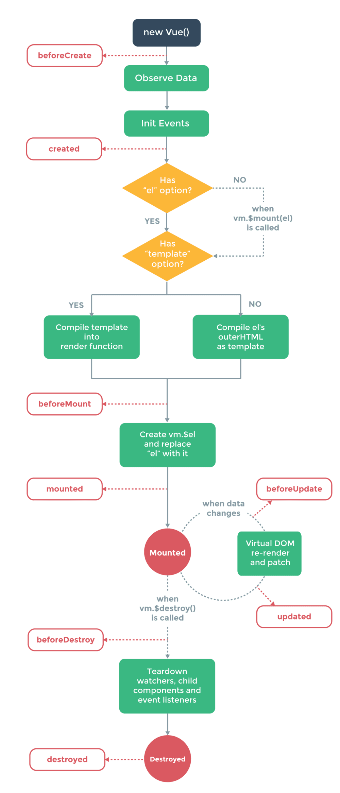

---

title: Vue 生命周期
date: 2020-04-19 16:56:44
tags:
	- vue
categories:
	- Vue
---

所有的生命周期钩子自动绑定 `this` 上下文到实例中，因此你可以访问数据，对属性和方法进行运算。这意味着**你不能使用箭头函数来定义一个生命周期方法** (例如 `created: () => this.fetchTodos()`)。这是因为箭头函数绑定了父上下文，因此 `this` 与你期待的 Vue 实例不同，`this.fetchTodos` 的行为未定义。

<!-- more -->

## beforeCreate：

​    在实例初始化之后，**数据观测(data observer) ** 和 event/watcher事件配置 之前被调用，
​    注意是 之前，此时data、watcher、methods统统滴没有。
​    这个时候的vue实例还什么都没有，
​    但是`$route`对象是存在的，可以根据路由信息进行重定向之类的操作。

## created：

​    在实例已经创建完成之后被调用。
​    在这一步，实例已完成以下配置：
​        数据观测(data observer) ，
​        属性和方法的运算， 
​        watch/event 事件回调。
​    然而，挂载阶段还没开始，$el属性目前不可见。
​    此时 this.$data 可以访问，
​    watcher、events、methods也出现了，
​    若根据后台接口动态改变data和methods的场景下，可以使用。

## beforeMount：

​    在挂载开始之前被调用，相关的 render 函数 首次被调用。
​    但是render正在执行中，此时DOM还是无法操作的。
​    我打印了此时的vue实例对象，相比于created生命周期，
​    此时只是多了一个$el的属性，然而其值为undefined。
​    使用场景我上文已经提到了，页面渲染时所需要的数据，应尽量在这之前完成赋值。

## mounted：

​    在挂载之后被调用。
​    在这一步 创建`vm.$el`并替换el，并挂载到实例上。

> （官方文档中的 “如果root实例挂载了一个文档内元素，当mounted被调用时`vm.$el`也在文档内” 这句话存疑）

​	 此时元素已经渲染完成了，依赖于DOM的代码就放在这里吧~比如监听DOM事件。

## beforeUpdate：

   ` $vm.data`更新之后，虚拟DOM重新渲染 和打补丁之前被调用。
    你可以在这个钩子中进一步地修改`$vm.data`，这不会触发附加的重渲染过程。

## updated：

​    虚拟DOM重新渲染 和打补丁之后被调用。
​    当这个钩子被调用时，组件DOM的data已经更新，
​    所以你现在可以执行依赖于DOM的操作。
​    但是不要在此时修改data，否则会继续触发`beforeUpdate`、`updated`这两个生命周期，进入死循环！

## beforeDestroy：

​    实例被销毁之前调用。在这一步，实例仍然完全可用。
​    实例要被销毁了，赶在被销毁之前搞点事情吧哈哈~

## destroyed：

​    Vue实例销毁后调用。
​    此时，Vue实例指示的所有东西已经解绑定，
​    所有的事件监听器都已经被移除，
​    所有的子实例也已经被销毁。
​    这时候能做的事情已经不多了，
​    只能加点儿提示toast之类的东西吧。

> 注：beforeMount、mounted、beforeUpdate、updated、beforeDestroy、destroyed这几个钩子函数，
> 在服务器端渲染期间不被调用。